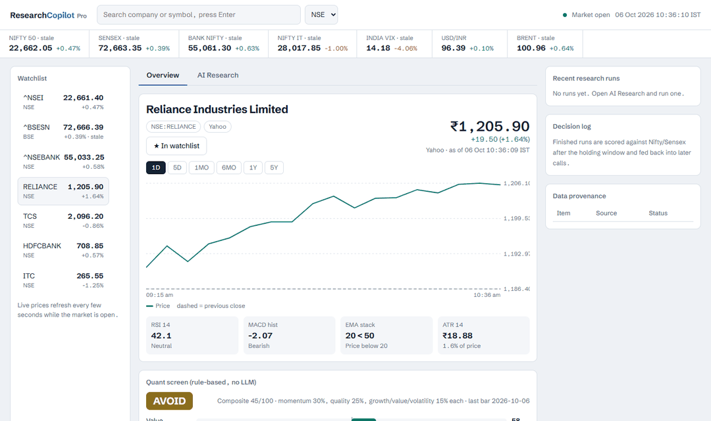
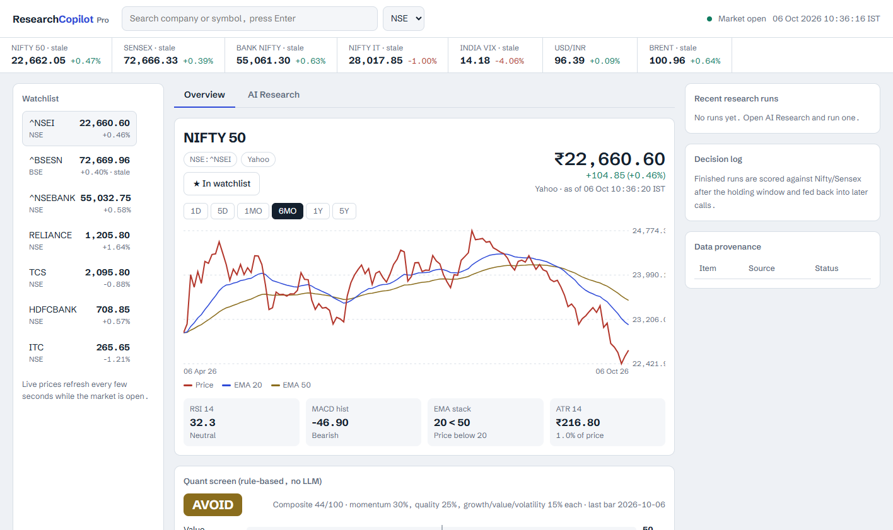
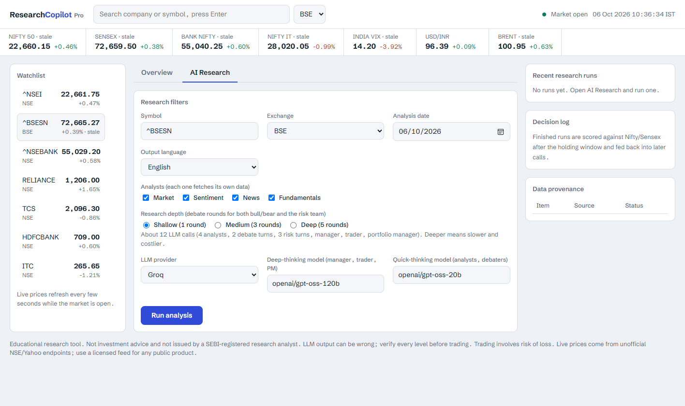
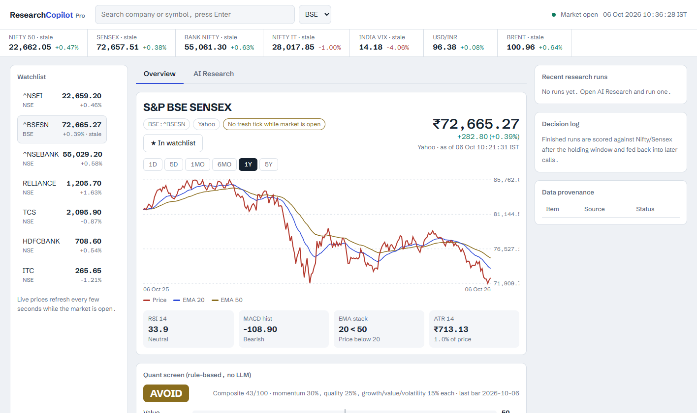

# Research Copilot Pro

**An Indian-market research terminal with a TradingAgents-style multi-agent desk.**
Live NSE/BSE quotes, index coverage, a rule-based quant screen, and a full analyst → bull/bear →
risk → portfolio-manager debate that ends in a rated, sized trade call.



<p align="center">
  
  
  
  
</p>

> Educational research tool. **Not investment advice.** LLM output can be wrong — verify every
> level before trading. See [Data & legal](#data-sources--legal).

---

## What it does

- **Live multi-source quotes.** NSE website JSON first, Yahoo 1-minute API second, `yfinance` last.
  Every price shows its source, the exchange timestamp, and a *stale* flag if the market is open but
  the tick is old. Auto-refreshes every few seconds.
- **Index coverage.** Nifty 50, Bank Nifty, Sensex, Nifty IT and India VIX (plus USD/INR and Brent)
  in a live strip — and **searchable like any stock**, with full price, chart and quant detail.
- **Honest watchlist.** Symbols join the watchlist **only when you explicitly save them**
  (★ button). Searching never pollutes it.
- **Rule-based quant screen.** EMA stack, RSI-14, MACD histogram, ATR and factor scores
  (Value / Quality / Growth / Momentum / Volatility) computed in Python — no LLM in the loop.
- **Multi-agent AI research.** A TradingAgents-style pipeline: four analysts in parallel →
  Bull vs Bear debate → Research Manager → Trader → Aggressive/Conservative/Neutral risk debate →
  Portfolio Manager, producing a 5-tier rating with entry / stop / target and a position-size check.
- **Screener.in-style fundamentals.** The Fundamentals analyst reads a data pack that layers computed
  ratios (net debt, D/E, interest coverage, current ratio, working capital, ROCE/ROE, OCF-vs-PAT cash
  conversion, YoY/QoQ growth, cash conversion cycle) plus annual *and* quarterly income statement,
  balance sheet and cash flow on top of Yahoo's headline multiples — all in ₹ crore, all computed by
  code so the model only cites verified figures.
- **Decision log & reflection.** After the holding window each call is scored against Nifty/Sensex,
  reflected on, and the lessons feed later Portfolio Manager prompts.
- **Provenance.** Every number is computed by code; the LLM only interprets. Each run records which
  data source answered what.

## The multi-agent pipeline

```
   Analysts (parallel)          Research                Trading        Risk (debate)        Portfolio
 ┌─────────────────────┐   ┌───────────────────┐   ┌───────────┐   ┌──────────────────┐   ┌──────────────┐
 │ Market   Sentiment  │   │  Bull  ⇄  Bear    │   │           │   │ Aggressive       │   │              │
 │ News     Fundamentals├──▶│        ↓         ├──▶│  Trader   ├──▶│ Conservative     ├──▶│ Portfolio Mgr│
 └─────────────────────┘   │  Research Manager │   │           │   │ Neutral          │   │  (final call)│
                           └───────────────────┘   └───────────┘   └──────────────────┘   └──────────────┘
```

Depth controls debate rounds (Shallow 1 / Medium 3 / Deep 5). Output language includes Hinglish.

## Screenshots

| Overview — index with chart & quant screen | AI Research — the multi-agent desk |
|:--:|:--:|
|  |  |

Index search returns full detail for benchmarks too (here, Sensex on BSE):



## Quick start

```bash
pip install -r requirements.txt
copy .env.example .env        # on Mac/Linux: cp .env.example .env
# paste ONE LLM API key into .env
uvicorn server:app --port 8000
```

Open <http://localhost:8000>.

Offline tests (no network, no keys):

```bash
pip install pytest httpx
python -m pytest tests -q
```

## Configuration

Pick any one provider in `.env` (or per-run in the UI): Anthropic, OpenAI, Google, DeepSeek, Groq,
OpenRouter, Ollama (local), or any OpenAI-compatible endpoint. Deep-thinking models drive the
manager / trader / portfolio manager; quick-thinking models drive analysts and debaters.

| Env var | Purpose |
|---|---|
| `ANTHROPIC_API_KEY`, `OPENAI_API_KEY`, `GROQ_API_KEY`, … | one key for your chosen provider |
| `COPILOT_LLM_PROVIDER` | force a provider |
| `COPILOT_DEEP_THINK_LLM` / `COPILOT_QUICK_THINK_LLM` | model ids |
| `COPILOT_OUTPUT_LANGUAGE`, `COPILOT_MAX_DEBATE_ROUNDS`, `COPILOT_RISK_PER_TRADE_PCT`, … | run defaults |

## Reports

Completed runs write a full report tree under `runs/<id>/` and a combined `complete_report.md`.
A real end-to-end sample is published at [`reports/UNIPARTS.md`](reports/UNIPARTS.md); more
(e.g. `POLICYBZR`) will follow — see [`reports/README.md`](reports/README.md).

### Provider request-size limits

Small/free LLM tiers cap tokens **per request** (e.g. Groq on-demand ≈ 8 000 TPM), and a naive
pipeline easily sends a 9 000+ token debate prompt, dying with `HTTP 413`. This project keeps every
call under the limit by capping what gets embedded: each analyst report is truncated to
`report_char_budget` chars and accumulated debate history to `debate_history_chars` chars (both
tunable via `COPILOT_REPORT_CHAR_BUDGET` / `COPILOT_DEBATE_HISTORY_CHARS`). Debater replies are also
token-bounded so later turns stay small.

## If a price looks wrong

Open `http://localhost:8000/api/diag/RELIANCE?ex=NSE`. It lists what **each** source returned for the
symbol, with timings and the spread between them, so a bad tick is traceable to its source.

## Project layout

```
server.py            FastAPI app: quotes, indices, search, chart, runs, reports
copilot/
  market.py          live NSE/Yahoo/yfinance quotes, indices, history, search
  dataflows.py       data packs per analyst (fundamentals, news, sentiment…)
  agents.py          the analyst / debater / manager / trader / PM prompts
  graph.py           orchestrates the pipeline
  indicators.py      EMA / RSI / MACD / ATR (pure Python)
  jobs.py            run manager, decision log, reflection
  reporting.py       markdown report tree
web/                 the dashboard (vanilla JS, no build step)
tests/               offline test-suite
```

## Data sources & legal

NSE and Yahoo endpoints are **unofficial, personal-use only** and can change or block requests at any
time — use a licensed feed for any public or paid product. Publishing buy/sell calls publicly may
require SEBI Research Analyst registration. This project is educational and is not investment advice.

## License

MIT

---

<p align="center">
  Built and maintained by <b>Khushal Jain</b><br>
  <a href="https://in.tradingview.com/u/khushaljain023/">
    
  </a>
</p>
